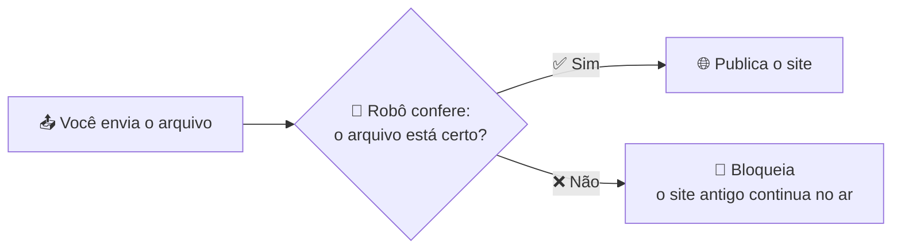

# 🚀 Lab: um robô que publica (ou bloqueia) o seu site

> 🎓 **UNINOVE** — Disciplina: **Automação de Processos**
> 📚 Tema: **DevOps** — Integração Contínua e Entrega Contínua (CI/CD)
> 👨‍🏫 Professor: **Marcelino Dias da Silva**

Você vai enviar um arquivo para o GitHub e ver um **robô** conferir e **publicar o site sozinho**.
Depois vai enviar um arquivo **quebrado** e ver o robô **bloquear** a publicação.

Não precisa instalar nada nem saber programar. Só um navegador. 🙌

---

## 🧠 A ideia

| Palavra | O que significa |
|---|---|
| **Repositório** | A pasta do projeto guardada no GitHub |
| **Commit** | Cada envio de arquivo fica registrado com data, autor e mensagem |
| **GitHub Actions** | O "robô" do GitHub que executa tarefas automaticamente |
| **CI** (Integração Contínua) | O robô **confere** tudo que é enviado |
| **CD** (Deploy Contínuo) | Se estiver tudo certo, o robô **publica** sozinho |
| **Deploy** | Colocar o site no ar |

---

## ✅ Passo 0 — Preparar (10 min)

1. Entre no [GitHub](https://github.com) com a sua conta.
2. Nesta página, clique no botão verde **Use this template** → **Create a new repository**.
3. Dê um nome (ex.: `meu-site`), deixe como **Public** e clique em **Create repository**.
4. No **seu** repositório, vá em **Settings** → **Pages** (menu da esquerda) → em **Source**, escolha **GitHub Actions**.
5. Baixe o arquivo **[arquivos-da-aula.zip](arquivos-da-aula.zip)** (botão de download ⬇️ no canto direito) e **extraia** no seu computador.
   Vai ter 3 pastas: `1-ok`, `2-quebrado` e `3-corrigido`, cada uma com um `index.html`.

---

## ✅ Passo 1 — Enviar o arquivo certo (10 min)

1. No seu repositório, na aba **Code**, clique em **Add file** → **Upload files**.
2. Arraste o `index.html` da pasta **`1-ok`**.
3. Lá embaixo, escreva a mensagem `Versão 1` e clique em **Commit changes**.
4. Abra a aba **Actions** e clique na execução que apareceu (a bolinha 🟡 significa "rodando").
5. Veja os dois blocos:
   - **1 - Verificar arquivo** → o robô confere as 3 regras ✅
   - **2 - Publicar site** → o robô coloca o site no ar ✅
6. Clique em **2 - Publicar site** → passo **Mostrar o endereço do site** e abra o link.
   (ou vá em **Settings → Pages**)

🎉 Seu site está no ar, **azul**, escrito **Versão 1**.

---

## ✅ Passo 2 — Enviar o arquivo quebrado 💥 (10 min)

1. **Add file** → **Upload files** → arraste o `index.html` da pasta **`2-quebrado`**.
2. Mensagem: `Versão 2` → **Commit changes**.
3. Vá na aba **Actions** e observe.
4. Abra o seu site e atualize a página (`Ctrl + F5`).

**O que você deve ver:**

- 🔴 **1 - Verificar arquivo** falhou.
- ⏭️ **2 - Publicar site** nem começou (foi pulado).
- 🌐 O site **continua azul, na Versão 1**. O arquivo quebrado **não chegou** ao público!

Clique no bloco vermelho e abra os passos: qual regra falhou? O que o robô escreveu?

> 💡 Abra o `index.html` no GitHub e role até o final: o arquivo foi enviado **pela metade**.

---

## ✅ Passo 3 — Corrigir (5 min)

1. **Add file** → **Upload files** → arraste o `index.html` da pasta **`3-corrigido`**.
2. Mensagem: `Versão 3 - corrigida` → **Commit changes**.
3. Confira: tudo ✅ ✅ e o site agora está **verde**, na **Versão 3**.

---

## 📝 Para responder

1. Quais são as 3 regras que o robô confere? (dica: estão escritas nos passos do bloco **1 - Verificar arquivo**)
2. No Passo 2, por que o site continuou na Versão 1?
3. Se não existisse o robô, o que teria acontecido com o site no Passo 2?
4. Na aba **Actions**, quantas execuções deram certo e quantas falharam?
5. Olhe o quadro cinza do site publicado: quem enviou, quando e qual o commit? Por que essa informação é útil numa empresa?
6. Cite um processo do dia a dia (da faculdade, do trabalho, de casa) que poderia ter um "robô conferindo antes de liberar".

---

## 🏆 Desafio (opcional)

Abra o arquivo `.github/workflows/publicar-site.yml` (é a "receita" do robô) e tente achar:

- onde está escrito **quando** o robô começa a trabalhar;
- onde estão as **3 regras**;
- a linha que diz que a publicação **só acontece se a verificação passar** (procure `needs`).

---

## 🆘 Deu problema?

| Sintoma | Solução |
|---|---|
| Aparece um ⚠️ "GitHub Pages ainda não está ligado" | Settings → Pages → Source: **GitHub Actions**. Depois envie o arquivo de novo. |
| A aba Actions pede para habilitar os workflows | Clique no botão para habilitar. |
| Enviei o arquivo e o site não mudou | Espere 1 minuto e atualize com `Ctrl + F5`. Confira se está tudo ✅ na aba Actions. |
| O arquivo enviado se chama `index (1).html` | Ele precisa se chamar exatamente `index.html`. Use sempre os arquivos das pastas extraídas do zip. |
| Criei o repositório como **Private** | Settings → General → lá embaixo **Change visibility** → **Public**. |
